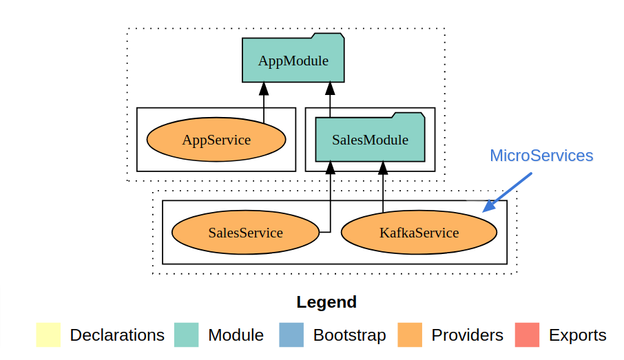

<p align="center">
  <a href="http://nestjs.com/" target="blank"></a>
</p>

## Prerequisites

* [Node.js](http://nodejs.org/) (with NPM)
* [Nestjs CLI](https://docs.nestjs.com/)
* [Mongodb](https://docs.mongodb.com/manual/installation/)
* [Kafka](https://kafka.apache.org/quickstart)
* [Docker](https://www.docker.com/get-started)

## High Level Architecture
This project is built on top of Nestjs 7.x and Nestjs CLI


## Overview
Created Restful API services in Nestjs. In Nest, a microservice is fundamentally an application that uses a different transport layer than HTTP, So by Kafka, we can publish and subscribe to streams of records, also the low-latency platform for handling real-time data feeds.

By using microservices, we can able to handle and process large sets of CSV data in the streaming pipeline and store it in the database with reliable performance.

## Workflow
* When the user calls `sales/record` API with CSV attachment, the CSV file will be stored in a directory and return the response of the HTTP request with `201` and also it will produce a message to Kafka, it consumes the message and process the CSV file and stores in the database.

* When the user calls `sales/report` API with a start date and end date params, it will fetch the data based on the request parameters.


## Project Setup

## Kafka Service
Install and start the service of kafka using docker.

```bash
$ docker-compose -f docker/kafka.yml up
```
## Kafka UI
Install and start the service of kafka UI using docker to monitor the topics & logs.

```bash
$ docker-compose -f docker/kafka-ui.yml up
```

## Running the app by docker
Start the API service using docker.

* Replace `localhost` with `db_mongo` in environment.ts, Because we should tell the app that we want to access MongoDb from docker internal virtual network and not the local one.

```bash
$ docker-compose -f docker-compose.yml up
```

## Installation
```bash
$ npm install
```

## Running the app

```bash
# development
$ npm run start

# watch mode
$ npm run start:dev

# production mode
$ npm run start:prod
```

## Test

```bash
# unit tests
$ npm run test

# e2e tests
$ npm run start
$ npm run test:e2e

# test coverage
$ npm run test:cov
```
